

  
  <h3>Simple password manager app that you can use to save and manage your passwords on the move. No more need to forget your passwords.</h3>

  
  
  
  
  

  Developed with ❤︎ by
  <a href="https://github.com/isaacjadrey">Isaac Jadrey Ongwara Jr</a>

## Features
- Built with Kotlin
- Create new passwords
- Password generator app
- Manage existing passwords
- Authenticate to access passwords
- Create app login password

## Getting Started
- Download or fork the repository
- Open project in android studio and run
- Authenticate using phone fingerprint credential

## Interest Work:
- The future interest is on working on the following (among other updates) :-

  **Encrypting passwords when created**
  
  **Decrypting the encrypted password to view**
 
  **Encrypting the database**
  
  * Interested parties are welcome to work on these updates.
  
 ## Sample app
 <h3 align="center">Dark Theme</h3>
 <table>
 <tr>
 <td>AuthScreen </td>
 <td>Home no items</td>
 <td>Home</td>
 <td>Add Password</td>
 <td>Update/Details</td>
 <td>Password Generator</td>
 <td>Settings</td>
 </tr>
 <tr>
 <td>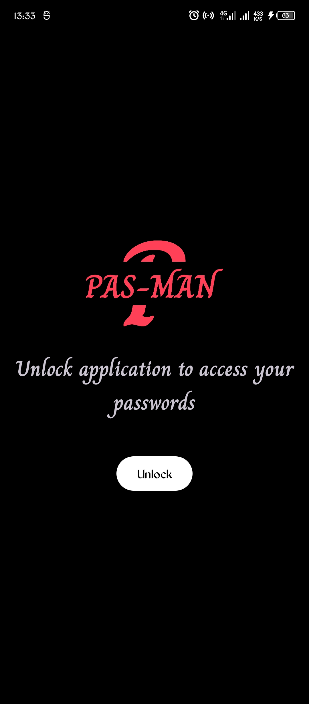</td>
 <td>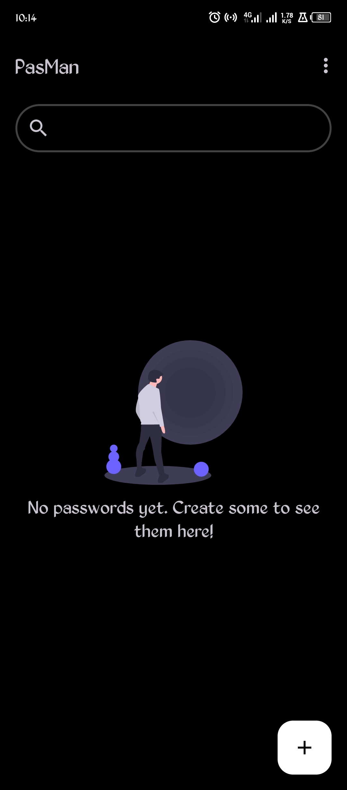</td>
 <td>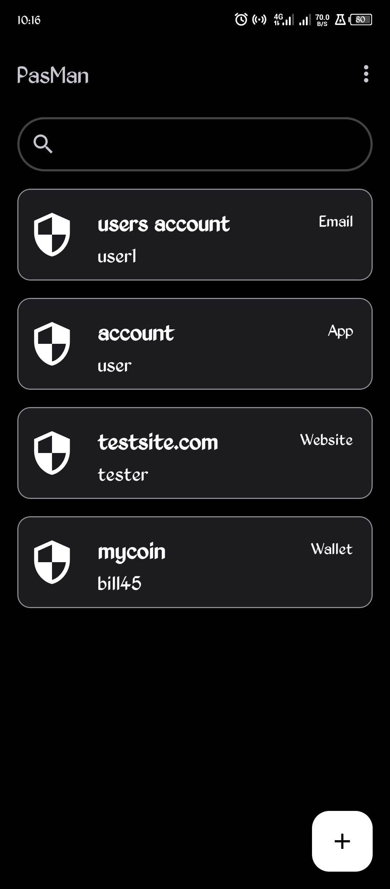</td>
 <td>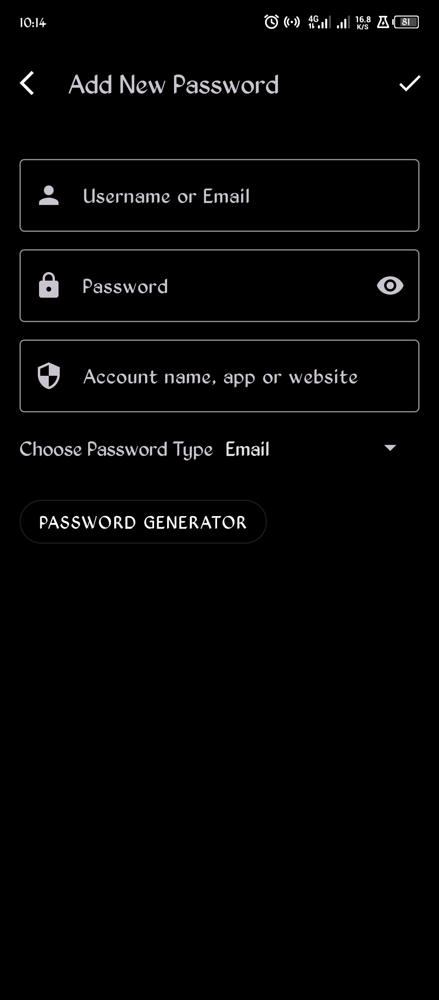</td>
 <td>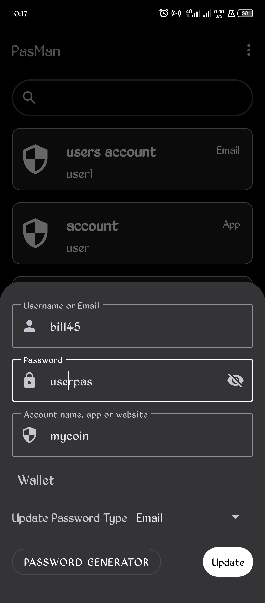</td>
 <td>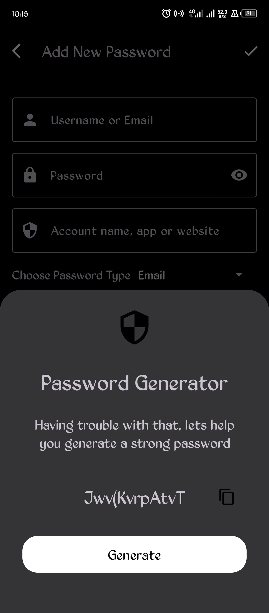</td>
 <td>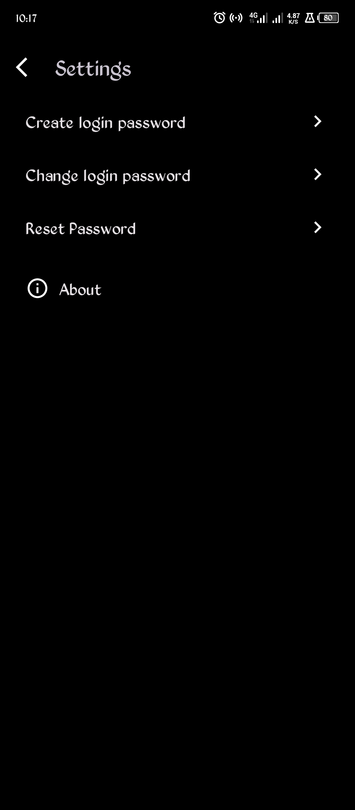</td>
 </tr>
 
 <table>
 <h3 align="center">Light Theme</h3>
 <tr>
 <td>AuthScreen </td>
 <td>Home no items</td>
 <td>Home</td>
 <td>Add Password</td>
 <td>Update/Details</td>
 <td>Password Generator</td>
 <td>Settings</td>
 </tr>
 <tr>
 <td>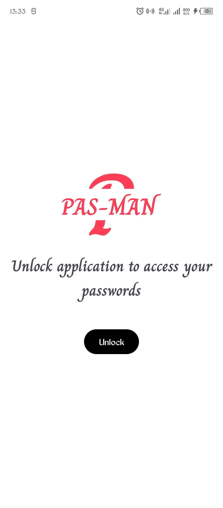</td>
 <td>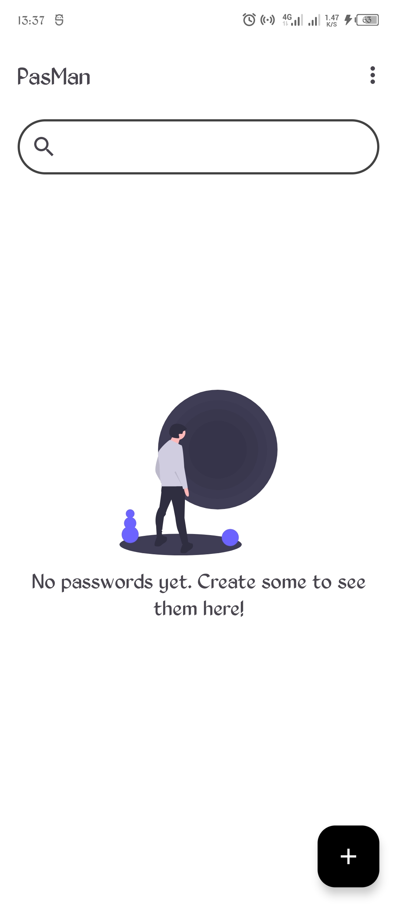</td>
 <td>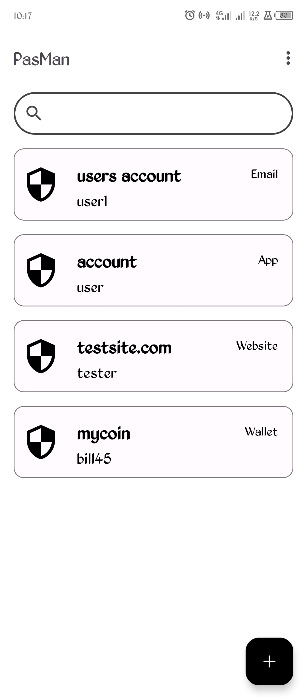</td>
 <td>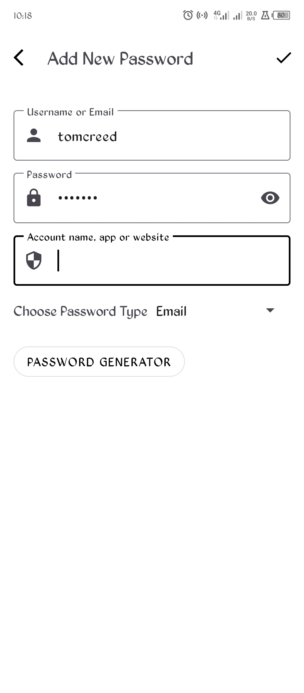</td>
 <td>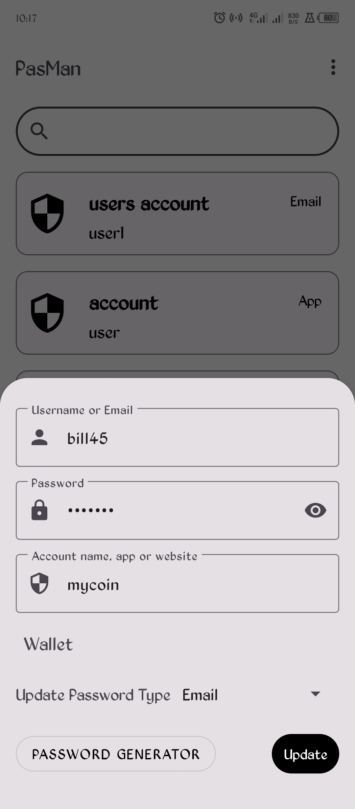</td>
 <td>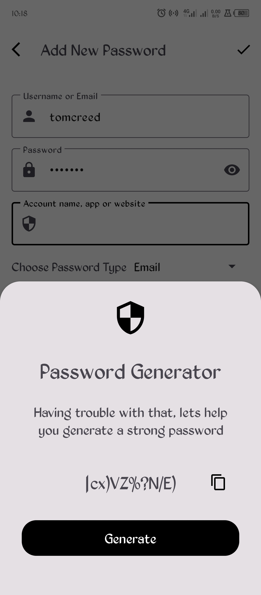</td>
 <td>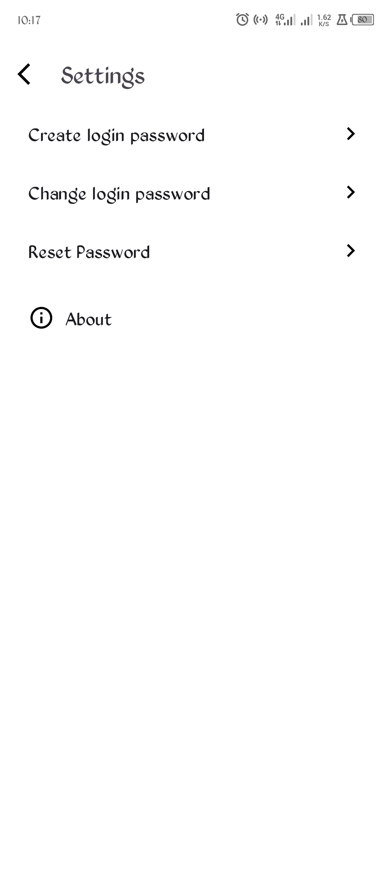</td>
 </tr>
 </table>

License
----------

    MIT License

    Copyright (c) 2022 Isaac Jadrey Ongwara Jr

    Permission is hereby granted, free of charge, to any person obtaining a copy
    of this software and associated documentation files (the "Software"), to deal
    in the Software without restriction, including without limitation the rights
    to use, copy, modify, merge, publish, distribute, sublicense, and/or sell
    copies of the Software, and to permit persons to whom the Software is
    furnished to do so, subject to the following conditions:

    The above copyright notice and this permission notice shall be included in all
    copies or substantial portions of the Software.

    THE SOFTWARE IS PROVIDED "AS IS", WITHOUT WARRANTY OF ANY KIND, EXPRESS OR
    IMPLIED, INCLUDING BUT NOT LIMITED TO THE WARRANTIES OF MERCHANTABILITY,
    FITNESS FOR A PARTICULAR PURPOSE AND NONINFRINGEMENT. IN NO EVENT SHALL THE
    AUTHORS OR COPYRIGHT HOLDERS BE LIABLE FOR ANY CLAIM, DAMAGES OR OTHER
    LIABILITY, WHETHER IN AN ACTION OF CONTRACT, TORT OR OTHERWISE, ARISING FROM,
    OUT OF OR IN CONNECTION WITH THE SOFTWARE OR THE USE OR OTHER DEALINGS IN THE
    SOFTWARE.
